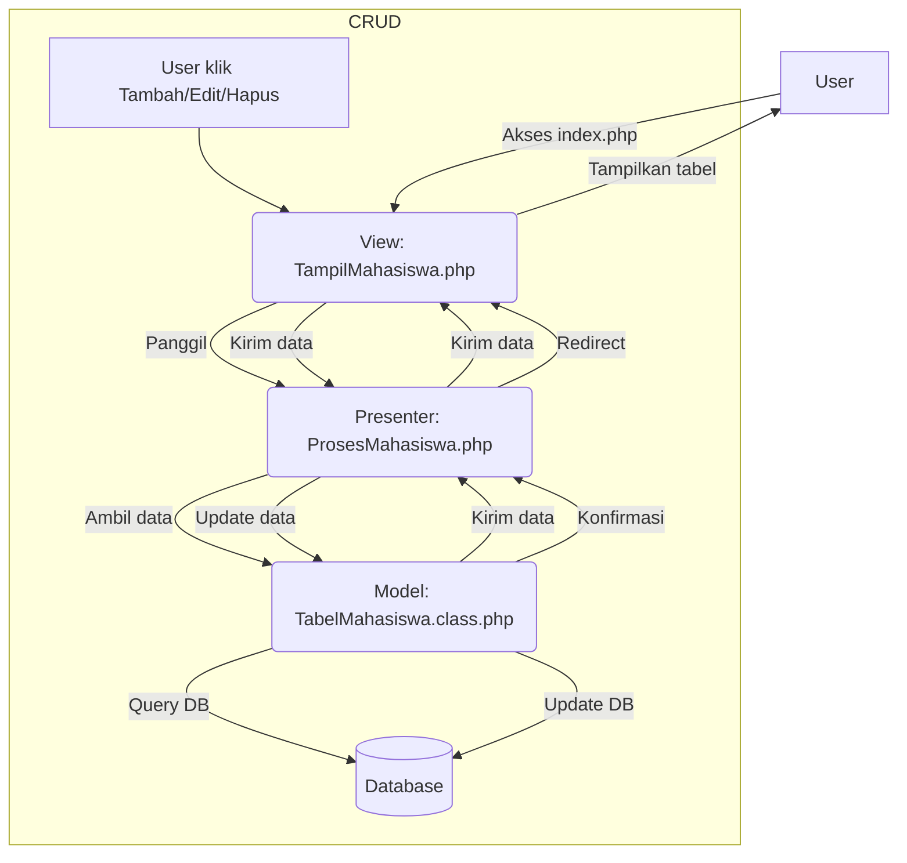

# TP9DPBO2025C1

# Janji
Saya Muhammad Ichsan Khairullah dengan NIM 2306924 mengerjakan Tugas Praktikum 9 dalam mata kuliah Desain dan Pemograman Berorientasi Objek untuk keberkahanNya maka saya tidak melakukan kecurangan seperti yang telah dispesifikasikan. Aamiin.

# Desain Program
## a. Model  
Model bertanggung jawab atas pengelolaan data dan interaksi dengan database.
- DB.class.php: Mengelola koneksi, eksekusi query, dan mengambil hasil dari database MySQL.
- Mahasiswa.class.php: Representasi entitas Mahasiswa, memiliki atribut id, nim, nama, tempat, tl, gender, email, dan telp. Memiliki metode getter dan setter.
- TabelMahasiswa.class.php: Menyediakan fungsi CRUD (Create, Read, Update, Delete) untuk tabel mahasiswa di database.
- Template.class.php: Mengelola template HTML.
## b. View  
View bertugas untuk menampilkan data dan menerima input dari user.
- KontrakView.php: Interface untuk View, memastikan fungsi tampil() ada.
- TampilMahasiswa.php: Menampilkan tabel mahasiswa, tombol aksi (edit, hapus, tambah), dan memanggil presenter untuk mengambil data.
## c. Presenter  
Penghubung antara View dan Model, serta mengelola logika aplikasi.
- KontrakPresenter.php: Interface untuk Presenter, mendefinisikan fungsi CRUD.
- ProsesMahasiswa.php: Penghubung View dan Model, menangani logika CRUD.
## d. Template  
- skin.html: Template HTML utama untuk tampilan tabel dan tombol aksi.
## e. index.php, add.php, edit.php, delete.php: Entry point aplikasi dan halaman aksi CRUD.

# Alur Program
1. Pengguna membuka halaman utama (index.php), yang memanggil View untuk menampilkan tabel mahasiswa.
2. View meminta Presenter untuk mengambil data mahasiswa dari Model.
3. Presenter mengambil data dari Model, lalu mengembalikannya ke View untuk ditampilkan.
4. Untuk operasi tambah, edit, atau hapus, View akan mengirim permintaan ke Presenter, yang kemudian meneruskan ke Model untuk memproses perubahan data.
5. Setelah operasi berhasil, pengguna diarahkan kembali ke halaman utama untuk melihat perubahan.

# Dokumentasi

